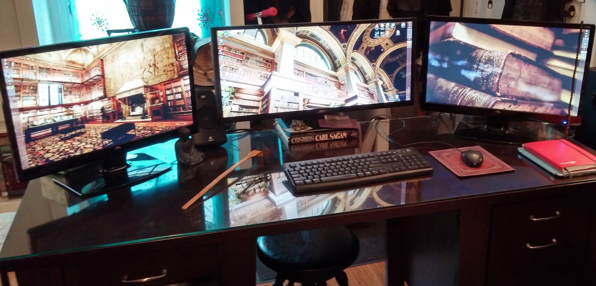

<h1>Hi Traveller, I am <a href="https://codeproline.com/">jeff leu</a></h1>

<!--  -->

# OVERVIEW

Senior full-stack developer with over 9 years of experience building high performing presentations, layers, building reusable components, and performance optimization with **JavaScript**, **Typescript**, **HTML**, **CSS**, back-end experience with **Node**, **PHP**, **Python**. Specialized in building 20+ usable, useful, well-constructed websites and applications using **React**, **Angular**, and **Vue**. About 2 projects, implemented 10k+ users with well-designed user interface components and the overall applications are robust, easy to maintain, and resolved 1k+ errors in the presented app.

# WHAT I DO

Creative web developer dedicated to building and optimizing the performance of high-impact websites for nationwide and global companies. Leverage technical, analytical, and problem-solving skills to create dynamic, high-speed websites, apps, and platforms fueling competitive advantage and revenue growth.

# ACHIEVEMENTS

- Excellent **Frontend** Development (HTML5, CSS3, Less, Sass, TailwindCss, Jade, Pug, Twig)
- **JAM** Stack Static Site Development (Gatsby, Contentful, Prismic)
- **MERN/MEAN/MEVN** Stack Development (Express, Nest, Koa, React, Vue, Angular, Next, Nuxt, MongoDB)
- **SAAS** Platform Development (GCP, Firebase, Firestore, App Engine, AWS EC2, S3, IAM, Lambda, DynomoDB)
- **Payment** Integration (Paypal, Stripe)
- **Mobile** App Development (iOS/Android) development (React Native, Flutter, Ionic, Cocopod, Swift)
- **DB** Design, Delivery System Development (MySQL, PostgreSQL, MongoDB)
- **Backend** Structure Development (Laravel, Codeigniter, Symfony, CakePHP, Java Maven, Spring, ASP.NET, .NET Core)
- **Ecommerce** CMS Development (WordPress, BuddyPress, Shopify, CraftCMS)
- **Visual Programming** (Bubble.io, WebFlow)
- **OOP** Functional Programming (C, C++, Python, Django, Flask, TensorFlow, Chatbot)

As the Director of Multimedia for Entravision Communications, Ray managed a network of radio and TV station websites on the East Coast. He designed large newspaper sites and created interactive projects/games for the Tribune network of newspapers.

## My Content
- [Twitter](https://twitter.com/jeffleu)
- [Instagram](https://www.instagram.com/jeff.leu.dev)
- [Facebook](https://www.facebook.com/jeffleu)
- [CodeRank](https://profile.codersrank.io/user/codeproline/)
- [GitHub](https://github.com/codeproline)
- [Email](jeff.leu.dev@gmail.com)
